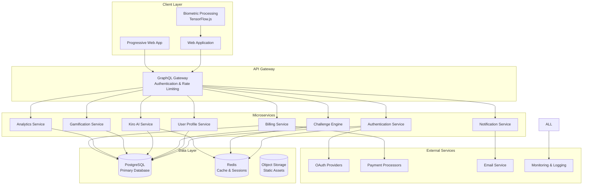
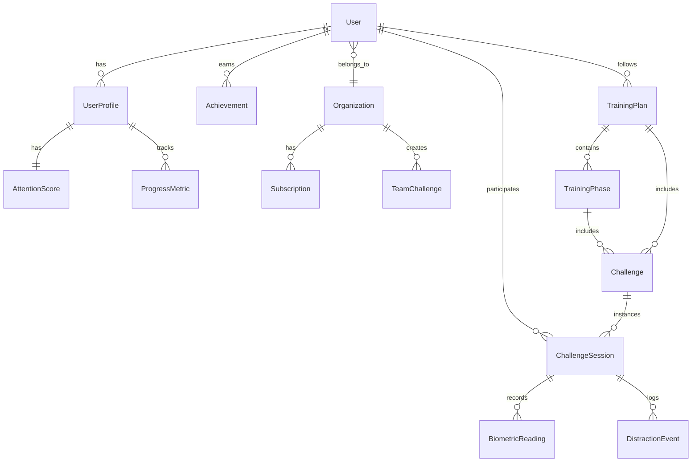

# Design Document - Focus Training Academy

## Overview

The Focus Training Academy is built as a cloud-native, microservices-based platform that delivers personalized focus training through AI-powered coaching, gamification, and real-time biometric feedback. The architecture prioritizes security, scalability, and user experience while maintaining enterprise-grade performance standards.

### Core Design Principles

- **Privacy by Design**: All biometric processing occurs client-side with zero raw data transmission
- **Microservices Architecture**: Independent, scalable services for different platform capabilities
- **Real-time Responsiveness**: Sub-200ms API responses with WebSocket support for live features
- **Progressive Enhancement**: Core functionality works without advanced features, enhanced with biometric feedback
- **Mobile-First Design**: Responsive UI optimized for cross-device usage patterns

## Architecture

### System Architecture Overview



### Technology Stack

**Frontend:**
- **Framework**: React 18 with TypeScript for type safety and developer experience
- **State Management**: Zustand for lightweight, scalable state management
- **UI Components**: Tailwind CSS + Headless UI for consistent, accessible design system
- **Real-time**: Socket.io client for live coaching and challenge updates
- **Biometric Processing**: TensorFlow.js + WebAssembly for client-side ML inference
- **PWA**: Service workers for offline capability and push notifications

**Backend:**
- **API Gateway**: Apollo Server (GraphQL) with authentication and rate limiting
- **Services**: Node.js with TypeScript and Express for consistent development experience
- **Authentication**: Passport.js with OAuth 2.0 strategies
- **Real-time**: Socket.io server for WebSocket connections
- **AI/ML**: Python FastAPI service for Kiro AI with GPU acceleration
- **Message Queue**: Redis Pub/Sub for inter-service communication

**Data & Infrastructure:**
- **Primary Database**: PostgreSQL 15 with read replicas for scalability
- **Caching**: Redis 7 for sessions, real-time data, and API caching
- **File Storage**: AWS S3 for static assets and user-generated content
- **CDN**: CloudFlare for global content delivery and DDoS protection
- **Deployment**: Docker containers on Kubernetes for auto-scaling
- **Monitoring**: DataDog for application performance monitoring and alerting

## Components and Interfaces

### 1. Authentication Service

**Responsibilities:**
- OAuth 2.0 integration with Google, Microsoft, Apple, Meta
- JWT token generation and validation
- Multi-factor authentication for admin accounts
- Session management and security policies

**Key Interfaces:**
```typescript
interface AuthService {
  authenticate(provider: OAuthProvider, code: string): Promise<AuthResult>
  validateToken(token: string): Promise<UserSession>
  refreshToken(refreshToken: string): Promise<TokenPair>
  enableMFA(userId: string, method: MFAMethod): Promise<MFASetup>
  logout(userId: string): Promise<void>
}

interface UserSession {
  userId: string
  email: string
  roles: Role[]
  permissions: Permission[]
  organizationId?: string
  expiresAt: Date
}
```

### 2. User Profile Service

**Responsibilities:**
- User profile management and preferences
- Attention score calculation and tracking
- Progress analytics and insights
- Privacy settings and data export

**Key Interfaces:**
```typescript
interface UserProfileService {
  createProfile(userData: CreateUserData): Promise<UserProfile>
  updateProfile(userId: string, updates: ProfileUpdates): Promise<UserProfile>
  calculateAttentionScore(assessmentData: AssessmentResponse[]): Promise<AttentionScore>
  getProgressAnalytics(userId: string, timeRange: TimeRange): Promise<ProgressAnalytics>
  exportUserData(userId: string): Promise<UserDataExport>
  deleteUserData(userId: string): Promise<DeletionConfirmation>
}

interface AttentionScore {
  overall: number // 1-100
  categories: {
    sustainedAttention: number
    selectiveAttention: number
    dividedAttention: number
    executiveAttention: number
  }
  strengths: string[]
  improvementAreas: string[]
  lastUpdated: Date
}
```

### 3. Challenge Engine Service

**Responsibilities:**
- Challenge creation and management
- Pomodoro timer functionality
- Distraction management scenarios
- Real-life task integration
- Performance tracking

**Key Interfaces:**
```typescript
interface ChallengeService {
  getChallenges(userId: string, filters: ChallengeFilters): Promise<Challenge[]>
  startChallenge(userId: string, challengeId: string): Promise<ChallengeSession>
  updateProgress(sessionId: string, progress: ProgressUpdate): Promise<void>
  completeChallenge(sessionId: string, results: ChallengeResults): Promise<CompletionReward>
  createCustomChallenge(userId: string, parameters: ChallengeParameters): Promise<Challenge>
}

interface Challenge {
  id: string
  type: 'pomodoro' | 'distraction_drill' | 'real_life_task' | 'custom'
  title: string
  description: string
  difficulty: 1 | 2 | 3 | 4 | 5
  estimatedDuration: number // minutes
  instructions: string[]
  successCriteria: SuccessCriteria
  rewards: Reward[]
}

interface ChallengeSession {
  id: string
  challengeId: string
  userId: string
  startTime: Date
  currentPhase: string
  biometricData?: BiometricInsights
  distractionEvents: DistractionEvent[]
}
```

### 4. Kiro AI Service

**Responsibilities:**
- Personalized training plan generation
- Dynamic challenge creation
- Conversational coaching support
- Progress analysis and recommendations
- Adaptive difficulty adjustment

**Key Interfaces:**
```typescript
interface KiroAIService {
  generateTrainingPlan(userProfile: UserProfile, goals: TrainingGoals): Promise<TrainingPlan>
  createCustomChallenge(request: CustomChallengeRequest): Promise<Challenge>
  provideCoachingtip(context: CoachingContext): Promise<CoachingResponse>
  analyzeProgress(userId: string, timeframe: TimeRange): Promise<ProgressInsights>
  adjustDifficulty(userId: string, performanceData: PerformanceMetrics): Promise<DifficultyAdjustment>
  chatWithUser(userId: string, message: string, context: ChatContext): Promise<ChatResponse>
}

interface TrainingPlan {
  id: string
  userId: string
  duration: number // weeks
  phases: TrainingPhase[]
  adaptationRules: AdaptationRule[]
  milestones: Milestone[]
  createdAt: Date
}

interface CoachingResponse {
  message: string
  actionItems: ActionItem[]
  resources: Resource[]
  followUpScheduled?: Date
  confidence: number
}
```

### 5. Gamification Service

**Responsibilities:**
- Points and XP calculation
- Badge and achievement management
- Streak tracking and recovery
- Leaderboards and social features
- Level progression system

**Key Interfaces:**
```typescript
interface GamificationService {
  awardPoints(userId: string, activity: Activity, points: number): Promise<PointsUpdate>
  checkAchievements(userId: string, activity: Activity): Promise<Achievement[]>
  updateStreak(userId: string, activity: Activity): Promise<StreakUpdate>
  getLeaderboard(scope: LeaderboardScope, timeframe: TimeRange): Promise<LeaderboardEntry[]>
  calculateLevel(userId: string): Promise<LevelInfo>
  getAvailableBadges(userId: string): Promise<Badge[]>
}

interface Achievement {
  id: string
  title: string
  description: string
  iconUrl: string
  rarity: 'common' | 'rare' | 'epic' | 'legendary'
  unlockedAt: Date
  shareableUrl: string
}

interface StreakUpdate {
  currentStreak: number
  longestStreak: number
  streakType: 'daily' | 'weekly' | 'challenge_completion'
  isActive: boolean
  nextMilestone: number
  recoveryOptions?: StreakRecoveryOption[]
}
```

## Data Models

### Core Entity Relationships



### Database Schema Design

**Users Table:**
```sql
CREATE TABLE users (
    id UUID PRIMARY KEY DEFAULT gen_random_uuid(),
    email VARCHAR(255) UNIQUE NOT NULL,
    oauth_provider VARCHAR(50) NOT NULL,
    oauth_id VARCHAR(255) NOT NULL,
    organization_id UUID REFERENCES organizations(id),
    subscription_tier VARCHAR(20) DEFAULT 'free',
    created_at TIMESTAMP DEFAULT NOW(),
    updated_at TIMESTAMP DEFAULT NOW(),
    last_active_at TIMESTAMP,
    is_active BOOLEAN DEFAULT true,
    
    UNIQUE(oauth_provider, oauth_id)
);
```

**User Profiles Table:**
```sql
CREATE TABLE user_profiles (
    id UUID PRIMARY KEY DEFAULT gen_random_uuid(),
    user_id UUID REFERENCES users(id) ON DELETE CASCADE,
    display_name VARCHAR(100),
    timezone VARCHAR(50),
    preferred_language VARCHAR(10) DEFAULT 'en',
    privacy_settings JSONB DEFAULT '{}',
    notification_preferences JSONB DEFAULT '{}',
    onboarding_completed BOOLEAN DEFAULT false,
    created_at TIMESTAMP DEFAULT NOW(),
    updated_at TIMESTAMP DEFAULT NOW()
);
```

**Attention Scores Table:**
```sql
CREATE TABLE attention_scores (
    id UUID PRIMARY KEY DEFAULT gen_random_uuid(),
    user_id UUID REFERENCES users(id) ON DELETE CASCADE,
    overall_score INTEGER CHECK (overall_score >= 1 AND overall_score <= 100),
    sustained_attention INTEGER CHECK (sustained_attention >= 1 AND sustained_attention <= 100),
    selective_attention INTEGER CHECK (selective_attention >= 1 AND selective_attention <= 100),
    divided_attention INTEGER CHECK (divided_attention >= 1 AND divided_attention <= 100),
    executive_attention INTEGER CHECK (executive_attention >= 1 AND executive_attention <= 100),
    assessment_data JSONB,
    calculated_at TIMESTAMP DEFAULT NOW(),
    
    UNIQUE(user_id, calculated_at)
);
```

**Challenges Table:**
```sql
CREATE TABLE challenges (
    id UUID PRIMARY KEY DEFAULT gen_random_uuid(),
    type VARCHAR(50) NOT NULL,
    title VARCHAR(200) NOT NULL,
    description TEXT,
    difficulty INTEGER CHECK (difficulty >= 1 AND difficulty <= 5),
    estimated_duration INTEGER, -- minutes
    instructions JSONB,
    success_criteria JSONB,
    rewards JSONB,
    is_active BOOLEAN DEFAULT true,
    created_by VARCHAR(50) DEFAULT 'system', -- 'system' or 'kiro'
    created_at TIMESTAMP DEFAULT NOW(),
    updated_at TIMESTAMP DEFAULT NOW()
);
```

**Challenge Sessions Table:**
```sql
CREATE TABLE challenge_sessions (
    id UUID PRIMARY KEY DEFAULT gen_random_uuid(),
    user_id UUID REFERENCES users(id) ON DELETE CASCADE,
    challenge_id UUID REFERENCES challenges(id),
    started_at TIMESTAMP DEFAULT NOW(),
    completed_at TIMESTAMP,
    status VARCHAR(20) DEFAULT 'in_progress', -- 'in_progress', 'completed', 'abandoned'
    performance_score INTEGER CHECK (performance_score >= 0 AND performance_score <= 100),
    session_data JSONB, -- stores session-specific data like timer states, responses
    biometric_insights JSONB, -- processed insights, not raw data
    distraction_events JSONB,
    completion_time INTEGER, -- actual time taken in seconds
    
    INDEX(user_id, started_at),
    INDEX(challenge_id, completed_at)
);
```

## Error Handling

### Error Classification and Response Strategy

**1. Client Errors (4xx)**
- **Authentication Errors (401)**: Invalid or expired tokens, failed OAuth
- **Authorization Errors (403)**: Insufficient permissions, subscription limits
- **Validation Errors (400)**: Invalid input data, malformed requests
- **Rate Limiting (429)**: API quota exceeded, too many requests

**2. Server Errors (5xx)**
- **Service Unavailable (503)**: Temporary service outages, maintenance mode
- **Internal Errors (500)**: Unexpected application errors, database failures
- **Gateway Timeout (504)**: Upstream service timeouts, network issues

**Error Response Format:**
```typescript
interface ErrorResponse {
  error: {
    code: string
    message: string
    details?: Record<string, any>
    timestamp: string
    requestId: string
    retryable: boolean
  }
}
```

### Resilience Patterns

**Circuit Breaker Pattern:**
```typescript
class CircuitBreaker {
  private failureCount = 0
  private lastFailureTime?: Date
  private state: 'CLOSED' | 'OPEN' | 'HALF_OPEN' = 'CLOSED'
  
  async execute<T>(operation: () => Promise<T>): Promise<T> {
    if (this.state === 'OPEN') {
      if (this.shouldAttemptReset()) {
        this.state = 'HALF_OPEN'
      } else {
        throw new Error('Circuit breaker is OPEN')
      }
    }
    
    try {
      const result = await operation()
      this.onSuccess()
      return result
    } catch (error) {
      this.onFailure()
      throw error
    }
  }
}
```

**Retry Strategy with Exponential Backoff:**
```typescript
async function retryWithBackoff<T>(
  operation: () => Promise<T>,
  maxRetries: number = 3,
  baseDelay: number = 1000
): Promise<T> {
  for (let attempt = 0; attempt <= maxRetries; attempt++) {
    try {
      return await operation()
    } catch (error) {
      if (attempt === maxRetries || !isRetryableError(error)) {
        throw error
      }
      
      const delay = baseDelay * Math.pow(2, attempt)
      await new Promise(resolve => setTimeout(resolve, delay))
    }
  }
}
```

## Testing Strategy

### Testing Pyramid Approach

**1. Unit Tests (70%)**
- **Coverage Target**: 90% code coverage for business logic
- **Framework**: Jest with TypeScript support
- **Focus Areas**: 
  - Service layer business logic
  - Data validation and transformation
  - Algorithm implementations (attention score calculation)
  - Utility functions and helpers

**2. Integration Tests (20%)**
- **Framework**: Jest with Supertest for API testing
- **Database**: Test containers with PostgreSQL
- **Focus Areas**:
  - API endpoint functionality
  - Database operations and transactions
  - Service-to-service communication
  - Authentication and authorization flows

**3. End-to-End Tests (10%)**
- **Framework**: Playwright for cross-browser testing
- **Environment**: Staging environment with test data
- **Focus Areas**:
  - Critical user journeys (registration, challenge completion)
  - Payment flows and subscription management
  - Cross-device compatibility
  - Accessibility compliance (WCAG 2.1 AA)

### Test Data Management

**Test User Personas:**
```typescript
const testUsers = {
  newUser: {
    email: 'newuser@test.com',
    attentionScore: null,
    subscriptionTier: 'free'
  },
  premiumUser: {
    email: 'premium@test.com',
    attentionScore: { overall: 65, categories: {...} },
    subscriptionTier: 'premium'
  },
  organizationAdmin: {
    email: 'admin@company.test',
    organizationId: 'test-org-123',
    roles: ['admin']
  }
}
```

### Performance Testing

**Load Testing Scenarios:**
- **Concurrent Users**: 1,000 simultaneous active sessions
- **API Throughput**: 10,000 requests per minute
- **Database Load**: 500 concurrent database connections
- **WebSocket Connections**: 5,000 simultaneous real-time connections

**Performance Benchmarks:**
- API response time: < 200ms (95th percentile)
- Database query time: < 50ms (average)
- Page load time: < 2 seconds (first contentful paint)
- WebSocket message latency: < 100ms

### Security Testing

**Automated Security Scans:**
- **SAST**: SonarQube for static code analysis
- **DAST**: OWASP ZAP for dynamic application security testing
- **Dependency Scanning**: Snyk for vulnerability detection in dependencies
- **Container Scanning**: Trivy for Docker image security analysis

**Manual Security Testing:**
- Penetration testing quarterly by third-party security firm
- OAuth flow security validation
- Biometric data handling verification
- GDPR compliance audit